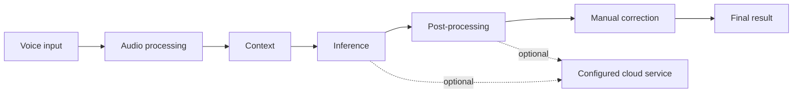

# Shuo Architecture

Shuo is organized around one visible path from speech to final text. The same
seven stages structure Advanced settings and the implementation boundaries.



The main path works locally. A dotted request is made only when the user
actively enables a cloud transcription or text feature.

## Stages

1. **Voice input** — A global push-to-talk shortcut captures one bounded
   recording.
2. **Audio processing** — Shuo detects useful speech and prepares audio for
   recognition without changing the archived source recording. When the voice
   activity gate is enabled, this happens locally before inference: a recording
   must meet its minimum duration, show sustained activity relative to its own
   noise floor, and clear a bounded usable-speech energy floor. This rejects
   quiet microphone ambience and brief transients without relying on a
   transcript phrase blacklist, while still admitting soft speech.
3. **Context** — Enabled terms, local project vocabulary, and reusable prompts
   are ranked into a bounded hint for engines and providers that support one.
   Project source and paths stay local. SenseVoice deliberately skips
   transcription hints rather than pretending to consume them.
4. **Inference** — A downloaded local Whisper or SenseVoice model, or a
   user-configured cloud service, produces an initial result.
5. **Post-processing** — Enabled rules handle formatting, punctuation, script
   conversion, replacements, and Emoji. Optional cloud text processing remains
   distinct from local rules.
6. **Manual correction** — The Floating Bar, History, menu actions, and voice
   editing create explicit before/after changes. Unsafe replacement falls back
   to copying the complete correction.
7. **Final result** — Shuo writes the result to the target app and retains
   related History data locally when the user keeps it.

## Code layout

```text
App/Views     SwiftUI UI and the Floating Bar
App/Stores    Observable state and orchestration
App/Services  Recording, permissions, inference, insertion, storage, updates
App/Models    Settings, History, vocabulary, correction, provider contracts
Config/       Optional feature profiles
Tests/        Unit and integration-contract checks
Scripts/      Build, verification, packaging, and update-feed tooling
web/          Public product site, privacy policy, and release notes
```

Views do not directly call cloud providers or write persistent files.
`AppState` coordinates a user-visible transaction; specialized services own
I/O and policy decisions.

## Cloud service ownership

Cloud-service selection is a configuration concern inside the inference and
optional cloud-text paths; it is not a view concern. `CloudServiceCatalog`
owns stable service IDs, picker order, fixed versus editable endpoints,
credential kind, supported workload, and discovery policy. A settings snapshot
then resolves into a `ResolvedCloudConnection` for either transcription or
text processing. `AppState` coordinates visible state, Keychain access, and
asynchronous work, while provider adapters retain their explicit request and
response contracts.

Built-in services use their declared adapter contract directly. Model discovery
can populate choices, but it never proves that a model supports a request
contract and is not a prerequisite to sending a built-in request. A Custom
OpenAI-compatible endpoint is different: it is user-configured, its API key is
scoped to normalized endpoint identity in Keychain, and it must pass the
non-sensitive model-interface test before Shuo sends a real recording through
that endpoint. Switching away from Custom and back restores its endpoint,
model selection, and verification state.

Provider plugins control visibility of built-in cloud services. Custom remains
visible and usable as the only cloud-service choice if an advanced profile
disables every built-in provider; this does not re-enable those providers or
relax Custom verification. Transcription and cloud-text connections remain
separate resolved workloads, with separate model selection and verification
state.

## Trust boundaries

- With local transcription selected and cloud AI off, audio and text stay on
  the Mac. The app has no account requirement or app telemetry.
- When a cloud feature is enabled, it receives only its current-task payload.
  Complete History, correction records, project source, and paths are not sent
  as background context.
- API keys are stored in macOS Keychain.
- Text insertion is treated as a boundary: Shuo only rewrites a recently
  verified target; otherwise it copies the correction instead of deleting
  uncertain content.
- History connects retained audio, initial results, final text, and explicit
  corrections. Storage recovery preserves damaged sources rather than silently
  discarding them.

## Change checklist

Before changing behavior, answer:

- Which stage owns it?
- Does it add microphone, Accessibility, disk, Keychain, or network access?
- Is its local/cloud boundary explicit and documented?
- Can it be cancelled, timed out, retried, and explained?
- Does failure preserve existing user data and avoid uncertain target edits?
- Are tests, localization, accessibility, and privacy documentation updated?
