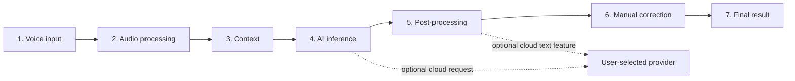
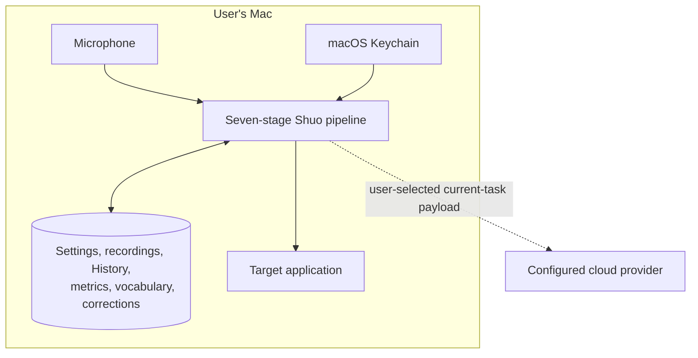

# Shuo Architecture

Shuo is a macOS voice-input application organized around one observable
seven-stage path. The same path structures the Advanced settings UI and the
implementation boundaries.



The solid path exists locally. Dotted edges appear only when the user selects a
cloud transcription provider or enables a cloud text feature.

## The seven stages

1. **Voice input** — A global push-to-talk shortcut starts and stops a bounded
   recording. The selected input device and permission state are resolved
   before capture.
2. **Audio processing** — Shuo records a 16 kHz mono WAV, detects useful speech,
   and can apply bounded normalization for quiet input. The archived source
   recording is not overwritten by processing.
3. **Context** — Enabled preferred terms, local project indexes, and reusable
   prompt contexts are ranked into a bounded request hint. Project source and
   paths remain local.
4. **AI inference** — A downloaded whisper.cpp model runs locally, or the
   current audio and bounded supported hints are sent to the provider the user
   selected. Optional text-model features use their separately configured
   endpoint.
5. **Post-processing** — Explicitly enabled deterministic operations handle
   punctuation, formatting, script conversion, fixed replacements, and Emoji.
   Optional cloud text processing is kept distinguishable from local rules.
6. **Manual correction** — The Floating Bar, History editor, menu actions, and
   voice-edit flow create explicit before/after events. Replacement returns only
   to a recently verified target application; unsafe cases fall back to copying
   the complete correction.
7. **Final result** — Shuo writes the result to the target app and links retained
   audio, raw model output, initial output, final text, and explicit correction
   metadata in local History when available.

## Runtime responsibilities

```text
App/Views     SwiftUI presentation, navigation, Floating Bar, History
     │
App/Stores    AppState orchestration and observable application state
     │
App/Services  capture, permissions, transcription, insertion, processing,
     │         persistence, recovery, updates, and provider clients
App/Models    settings, provider contracts, History, vocabulary, corrections

Config/       optional feature/provider profiles
Tests/        unit, integration-contract, and release-script checks
Scripts/      verification, runtime preparation, packaging, signing, appcast
web/          static product site, privacy policy, releases, and update feed
```

`AppState` coordinates the user-visible transaction, but specialized services
own I/O and policy decisions. Views should not call cloud providers or write
persistent files directly. Models crossing storage or provider boundaries
should remain explicit and testable.

## Privacy and trust boundaries



With Local transcription selected and cloud AI disabled, voice and text stay on
the Mac. Shuo requires no account and the application sends no Shuo telemetry,
behavioral analytics, or crash reports.

When a cloud stage is enabled, its request contains only the current task data
described in the privacy policy: for example the current audio, provider
settings, bounded spelling hints, or transcript text and an enabled
instruction. API keys remain in Keychain. Complete History, correction events,
project source, and project paths are not uploaded as background context.

The product website has a separate, disclosed analytics boundary. Website
analytics are not application telemetry and must not be silently introduced
into the app.

## Persistence and recovery

History is the durable user-owned record connecting audio and text. Explicit
corrections are captured even while correction learning is disabled so the user
can opt into future local use without losing earlier evidence. Learning and
automatic application of a pattern are separate choices.

Storage code should prefer atomic replacement, preserve a damaged source before
recovery, and surface failures rather than silently discarding data. Clearing a
derived metric or learning cutoff must not delete retained History or audio
unless the user invokes the corresponding deletion flow.

## Text insertion and correction safety

Text insertion crosses from Shuo into an arbitrary target application and is
therefore treated as a trust boundary. Shuo records the target process and
recent insertion transaction. A correction may use a changed-suffix rewrite
only while its application and interaction guards still match. Otherwise the
full corrected text is copied for the user instead of deleting uncertain
content.

Terminal applications are important targets but expose different Accessibility
semantics from native text fields. Application-specific behavior belongs behind
tested insertion policies, not in view code.

## Extension boundary

Optional provider and processing features are represented by explicit
configuration profiles and shared service protocols. The default interface
remains small; an advanced feature should be independently discoverable,
disableable, and removable without destabilizing the hold—speak—release loop.

A new provider must define its request boundary, credential storage, supported
models and languages, timeouts, cancellation, error mapping, and tests. A new
post-processing feature must state whether it is deterministic and local or
requires a cloud text request.

## Official and community builds

The source is GPL-3.0, but build provenance remains visible:

| Property | Official Shuo release | Community build or fork |
| --- | --- | --- |
| Source | Exact matching public Git tag in the canonical repository | Disclosed source and modifications |
| Product identity | Shuo name, icon, and official bundle ID | `Shuo Community` / `org.shuo.community`, or a fork-owned identity |
| Signing | Official Developer ID | Ad-hoc by default; redistribution is the distributor's responsibility |
| Notarization | Apple-notarized and stapled | Distributor's responsibility |
| Updates | Official signed Sparkle feed | Sparkle unlinked; no official update feed |
| Credentials | Official Keychain service identifiers | `org.shuo.community` Keychain prefix |
| Support | Official Shuo channels | Distributor's clearly identified channel |

`ShuoCommunity` is a shared scheme that reuses the `Shuo` application target
with its Community build configuration; it is not a third application target.
That configuration signs ad-hoc without a developer account and stores
application data under `Shuo Community` rather than the official Application
Support directory. This lets a developer install and test it without
overwriting official settings or History.

The official signing certificate, notarization profile, Sparkle private key,
and operational credentials are not part of the source repository. Community
builds must not impersonate official releases; see [TRADEMARK.md](TRADEMARK.md)
and [BUILDING.md](BUILDING.md).

## Architectural change checklist

Before merging a change that crosses stages or boundaries, verify:

- Which of the seven stages owns the behavior?
- Does it add disk, Keychain, Accessibility, microphone, or network access?
- Is the Local-only promise still true when all cloud features are disabled?
- Can the operation be cancelled, timed out, retried, and explained?
- Are original recordings and existing user data preserved?
- Does failure avoid deleting or overwriting uncertain target content?
- Are localization, accessibility, privacy documentation, and tests updated?
